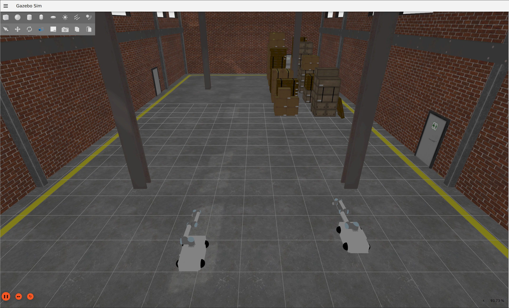

This ROS2 package implements the simulation of multiple mobile manipulators in gz.  
The package has been tested on ros rolling with gazebo garden.  
The deafult lancher "ros2 launch lampo_description lampo_gz_mm.launch.py" spawns two omnidirectional mobile manipulators endowed with an UR10 in a simulated whareouse.  
Due to the fact that gz_ros_control works only with a single robot, a topic hardware interface is used to connect to gz(https://github.com/PickNikRobotics/topic_based_ros2_control).  

  